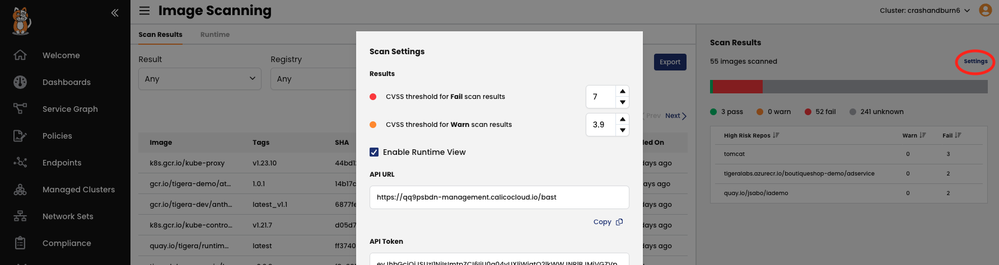

# Hands-on EKS Workshop


## Preparation

Once you clone the repo, all the yaml files to be applied below are in the "manifests" folder.

### Create your EKS cluster

Calico can be used as a CNI, or you can decide to use AWS VPC networking and have Calico only as plugin for the security policies. 

We will use the second approach during the workshop. Below an example on how to create a two nodes cluster with an smaller footprint, but feel free to create your EKS cluster with the parameters you prefer. Do not forget to include the region if different than the default on your account.

```
eksctl create cluster --name <CLUSTER_NAME> --version 1.21 --node-type m5.xlarge
```

### Connect your cluster to Calico Cloud

Subscribe to the free Calico Cloud trial on the link below:

https://www.calicocloud.io/home

Once you are able to login to Calico Cloud UI, go to the "Managed clusters" section, and click on the "Connect Cluster" button, then leave "Amazon EKS" selected, and give a name to your cluster, and click "Next". Read the cluster requirements in teh next section, and click "Next". Finally, copy the kubectl command you must run in order to connect your cluster to the management cluster for your Calico Cloud instance.


## Reduce the Attack surface of your environment, and follow a Zero Trust approach

### Decrease the time to collect flow logs

By default, flow logs are collected every 5 minutes. We will decrease that time to 30 seconds, which will increase the amount of information we must store, and while that is not recommended for production environments, it will help to speed up the time in which events are seen within Calico observability features.

```
kubectl patch felixconfiguration.p default -p '{"spec":{"flowLogsFlushInterval":"30s"}}'
```

### Deploy an application

We included an small test application, but you can use your own:

```
kubectl create -f manifests/deployments/yao-ns.yaml
kubectl create -f manifests/deployments/yaobank.yaml
```

Make sure all pods are running:

```
kubectl get pod -n yaobank -l pci=true
```

If using the test application above, expose the frontend service in your EKS cluster:

```
kubectl expose svc customer -n yaobank --type LoadBalancer --name yaobank --port 80
```

If you check your services in the yaobank namespace, you should have an external FQDN associated with the service you created above pointing to an AWS LB. Check you can resolve that FQDN, and then verify you can reach the yaobank application in your browser.

```
kubectl get svc -n yaobank
```

You will see the yaobank deployment the corresponding label "pci=true", that label will be matched with our policies to isolate the PCI workloads, and show how Calico's tiered security policies work.

### Create a Tier structure

Tiers are a hierarchical construct used to group policies and enforce higher precedence policies that cannot be circumvented by other teams. 

All Calico and Kubernetes security policies reside in tiers. You can start “thinking in tiers” by grouping your teams and types of policies within each group. The command below will create three tiers (quarantine, platform, and security):

```
kubectl create -f manifests/tiers/tiers.yaml
```

For normal policy processing (without apply-on-forward, pre-DNAT, and do-not-track), if no policies within a tier apply to endpoints, the tier is skipped, and the tier’s implicit deny behavior is not executed.

For example, if policy D in Tier 2 includes a Pass action rule, but no policy matches endpoints in Tier 3, Tier 3 is skipped, including the end of tier deny. The first policy with a matching endpoint is in Tier 4, policy J.


### Apply the Security Policies

Apply all the policies in the directory below:

```
kubectl create -f manifests/netpol
```

That will create a quarantine policy we will use later, another policy to protect our coredns service, a third policy in case we want to enforce traffic on the k8s nodes themselves. There is an additional compliance policy which will not be used in these exercises.

Now let's create the polcies in the folder below:

```
kubectl create -f manifests/netpol/ws/
```

That will cerate a deny all rule which will catch up all the traffic that has not been matched explicitly, so it will allow us to implement a Zero-Trust approach in our environment. For a further explanation on how a Zero-Trust model can help you to mitigate threats in your environment, and other security policies recommendations and best practices, please check: 

https://docs.tigera.io/security/policy-best-practices

Finally, let's implement some microsegmentation rules for our yaobank application:

```
kubectl create -f manifests/netpol/additional/yaobank 
```

Now you will not be able to reach the application anymore, as we have effectively isolated all endpoints in our environment labeled as pci=true with a single policy, in combination with the default deny rule we implemented at the end of our policy chain.

### Policy recommendation

Now let's see how Calico can help us to build a microsegmentation policy in order to allow the traffic to our frontend service.

Click in the Policy Recommendation button in the Policy Board:


Now select the time range you will look back in the flow logs to recommend a policy based on them. You must have tried to access the yaobank service, select the time range to include those attempts, and at least allow for the "flowLogsFlushInterval" you configured in the preparation section, otheriwse, you will not retrieve the data needed.

Select the namespace of the application we want the recommended policy for (yaobank), and the right service (customer-<hash>). Unselect the "Unprotected only" box.

When you click on the "Recommend" button in the top right corner, you will see that Calico recommends to open the traffic to port 80 on Ingress, so we would be able to reach the frontend application again. Click on "Enforce", and then the "Back" button.
  
The policy will be created at the end of your policy chain (at the bottom of the default Tier). You must move the policy to the right order, so it can have effect. In our case, as we would like to hit this policy before the pci isolation policy is done (so we are able to reach the customer service before it is isolated), drag and drop the policy in the board to the right place as indicated by the figure below:


Now you should be able to access the yaobank application in your browser.
  
## About Global ThreatFeeds

https://docs.calicocloud.io/threat/global-threatfeed/

## Compliance reports

Let's implement a couple of reports:

```
kubectl create -f manifests/compliance/
```

As reports are scheduled using a cronjob format, and we will not like to wait until the next occurrence of them, let's check the timestamp they have been created at, as we will use that value to run a report on demand:

```
kubectl get globalreports
```

You will see something like the output below:

```
$ kubectl get globalreports
NAME                         CREATED AT
daily-production-inventory   2022-04-28T06:48:06Z
```


> You will need to edit the report to adjust to the correct date, so you do not have to wait for the next daily schedule

You can patch the report with the right values executing for example:

```
kubectl patch globalreport daily-production-inventory -p '{"spec": {"schedule": "%M %H * * *"}}'
```

Go to the Compliance menu, and download the report clicking in the arrow pointing down to examine its content.


## Image Assurance

Image Assurance is based on the Common Vulnerabilities and Exposures (CVE) system, which provides a catalog of publicly-known security vulnerabilities and exposures. Image Assurance provides a command-line interface (CLI) to scan images, with the option to send results to the Manager UI. Additionally, Calico Cloud uses Kubernetes Validating Webhook Configuration to register an Admission Controller as a callback to accept or reject resources that create pods (such as deployments and daemonsets).

Let's start downloading the CLI scanner, for that, please go to the Welcome page of Calico Cloud (denoted with the Home icon ). You must have docker daemon running on the system where you plan to run the scanner, as the images will be downloaded and scanned locally on that system.

Then make the file executable:

```
chmod +x ./tigera-scanner
```

Now let's scan a couple of images we intent to deploy. For this you will need two items, one being the unique FQDN of the management cluster displayed in the address/navigation bar of your browser, and the other a token to upload the scan results to it. You can obtain both going to the menu "Image Assurance > Scan Results", and then clicking on the far right of the screen on "Settings":



Put those parameters into variables, so we can use them later:

```
export CC_URL=<URL retrieved>
```
```
export CC_TOKEN=<TOKEN>
```

Then you can scan your own images for this part of the exercise, however we will be demonstrating how to accomplish this with three images for the application we just rolled out:
  
> You must have the docker daemon running on the system where you run the following commands

```
docker pull calico/yaobank-database:certification
```

```
./tigera-scanner scan calico/yaobank-database:certification --apiurl $CC_URL --token $CC_TOKEN
```

At this point we will install Calico Cloud admission controller to prevent those images to be deployed. For this let's create a directory where we will create a TLS certificate and key pair. These will be used for securing TLS communication between the Kubernetes API server and the Admission controller:

> You must have a reasonably recent version of OpenSSL, or LibreSSL to successfully generate the keys, as older releases do not support the '-addext' argument which is required to include a 'subjectAltName' in the certificates.

Additionally we will download and configure the Admission Controller manifests, and configure the Kubernetes API server to send admission requests to our Admission Controller only for resources from relevant namespaces (in our example the yaobank namesapace label tenant=tenant1):

```
mkdir admission-controller-install && cd admission-controller-install
export URL="https://installer.calicocloud.io/manifests/v3.14.1-1/manifests" && curl ${URL}/generate-open-ssl-key-cert-pair.sh | bash
export URL="https://installer.calicocloud.io/manifests/v3.14.1-1/manifests" && \
export IN_NAMESPACE_SELECTOR_KEY="image-assurance" && \
export IN_NAMESPACE_SELECTOR_VALUES="enabled" && \
curl ${URL}/install-ia-admission-controller.sh | bash
```

> Please note this will only work on linux operating systems, if you run a different distribution you may need to adjust them yourself. There is a README file in the manifests/admission-controller folder with some hints on how to achieve this.
  
Apply the generated manifest:

```
kubectl apply -f ./tigera-image-assurance-admission-controller-deploy.yaml
```

Now let's return to our working directory, and delete the yaobank resources (among thenm the namespaced policies we created):
  
```
cd ..
kubectl delete -f manifests/netpol/ws/
kubectl delete -f manifests/netpol/additional/yaobank
kubectl delete svc yaobank -n yaobank
kubectl delete -f manifests/deployments/yaobank.yaml --grace-period=0
```

Then apply an admission controller policy:

```
kubectl apply -f manifests/admission-controller/container-admission-policy.yaml
```

This policy will prevent the deployment of any image which scan result is 'Fail' in the namespaces the admission controller is monitoring. Let's label the namespaces as we have defined:

```
kubectl label namespace yaobank image-assurance=enabled
```
  
Try to create the application again:
  
```
kubectl apply -f manifests/deployments/yaobank.yaml
```

As you should have seen, the application deployment has been prevented by the admission controller, as they do not satisfy the criteria applied because they contain some CVEs which need to be addressed.
  
## Deep Packet Inspection
  
Deploy a couple of pods for testing:
  
```
kubectl run nginx1 --image nginx:latest
kubectl run nginx2 --image nginx:latest
```

Expose one of the pods:
  
```
kubectl expose pod nginx1 --name nginx-svc --port 80
```
  
Label both pods, so we can open the traffic for them with a security polciy, and they do not hit the default deny rule:
  
```
kubectl label pod --all app=nginx
```
  
Then, create a policy for the pods:
  
```
kubectl create -f manifests/netpol/additional/dpi/dpi-test-policy.yaml
```

And now, implement DPI for them:
  
```
kubectl create -f manifests/dpi/dpi.yaml
```

This will create a daemonset, with some pods running in the tigera-dpi namesapce. The pods will take a while to be ready depending on the cluster you created, you can check progress with:
  
```
kubectl get pod -n tigera-dpi -w
```
  
Once they are running test the DPI feature entering the nginx2 pod, and executing the curl call below:
  
```
kubectl exec -it nginx1 -- sh
```

```
curl http://nginx-svc/secid_canceltoken.cgi -H 'X-CMD: Test' -H 'X-KEY: Test' -XPOST
```
  
Verify you are getting an alert:
  

  
## Honeypods

https://docs.calicocloud.io/threat/honeypod/honeypods
  
  
## Housekeeping
  
Disable DPI:
  
```
kubectl delete -f manifests/dpi/dpi.yaml
```
  
Delete both nginx pods and service:
  
```
kubectl delete pod nginx1
kubectl delete pod nginx2
kubectl delete svc nginx-svc
```

Remove the previous deployed Security policies:
  
```
kubectl delete -f manifests/netpol/ws/
```
```
kubectl delete -f manifests/netpol
```
```
kubectl delete -f manifests/netpol/additional/yaobank 
```
```
kubectl delete -f manifests/netpol/additional/dpi/dpi-test-policy.yaml
```
  
Delete the tiers:
  
```
kubectl delete -f manifests/tiers/tiers.yaml
```

Remove the yaobank application:
  
```
kubectl delete ns yaobank
```

If you used policy recommendation to create a policy to access the yaobank application, remove it from the Policy Board.

Remove the cluster if not needed:
  
```
eksctl delete cluster <CLUSTER_NAME> 
```
